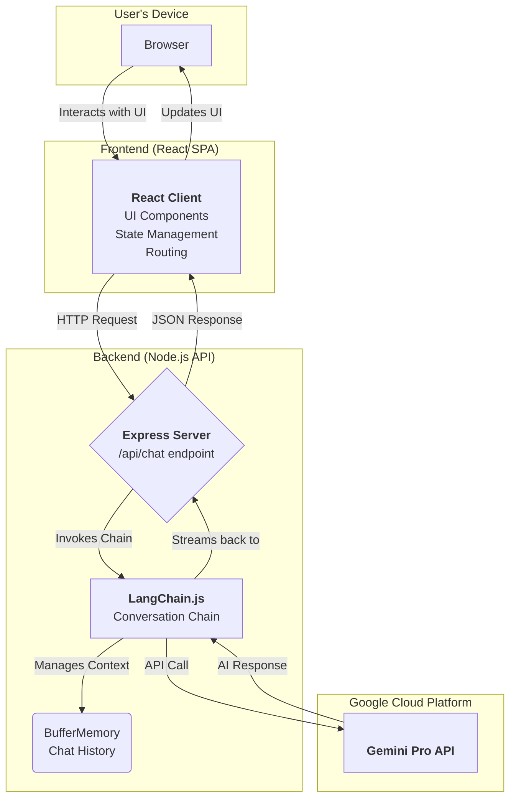

# TechPath Scout

## 🚀 Vision

TechPath Scout is a modern web application designed to be the ultimate career co-pilot for aspiring and current developers. In a tech landscape that is vast and often confusing, our platform provides personalized, data-driven guidance to help users discover the tech domain where they can truly excel. We aim to replace career uncertainty with a clear, actionable roadmap, ensuring that developers don't just find a job, but build a fulfilling, long-term career.

---

## ✨ Key Features

The application is broken down into several key features that guide the user from discovery to decision.

### 1. **Personalized Career Assessment**
- **The Problem:** Many developers choose their c
areer path based on trends or peer pressure, not personal aptitude.
- **Our Solution:** Users take a multi-faceted quiz that analyzes their personality traits, logical reasoning (IQ), and problem-solving styles.
- **The Outcome:** The platform generates a detailed analysis, identifying the user's core strengths and mapping them to specific tech domains.

### 2. **AI-Powered Career Assistant**
- **The Problem:** Generic career advice online doesn't address individual questions or concerns.
- **Our Solution:** An integrated AI chatbot, powered by Google's Gemini Pro and LangChain, serves as a personal career advisor. It remembers the context of the conversation, allowing for deep, nuanced discussions.
- **The Outcome:** Users can ask specific questions—from "What's the difference between a Data Scientist and a Data Analyst?" to "Based on my results, what project should I build?"—and receive instant, tailored advice.

### 3. **Data-Driven Domain Recommendations**
- **The Problem:** It's hard to know what a tech role *actually* entails day-to-day.
- **Our Solution:** The platform provides unique recommendations based on an analysis of over 5,000 developer career paths and current market trends.
- **The Outcome:** Users receive a downloadable report that not only suggests ideal domains (e.g., AI/ML, Data Science, Web Development, Cybersecurity) but also provides free resources and a clear path to get started.

---

## 🛠️ Technology Stack

TechPath Scout is built with a modern, scalable, and efficient technology stack.

-   **Frontend:**
    -   **Framework:** React with Vite for a fast, modern development experience.
    -   **Routing:** React Router DOM for seamless single-page application navigation.
    -   **Styling:** Plain CSS with a focus on modern design principles, including Flexbox and Grid.
    -   **Animations:** Framer Motion and custom CSS animations for a fluid and engaging user interface.

-   **Backend:**
    -   **Framework:** Node.js with Express for a lightweight and robust API server.
    -   **AI Integration:** LangChain.js to structure and manage interactions with the language model.
    -   **Language Model:** Google's Gemini Pro API provides the core intelligence for the AI assistant.
    -   **Deployment:** The backend is configured to be easily deployable on services like Vercel or any Node.js environment.

---

## 🏛️ Architecture

TechPath Scout is built on a decoupled client-server architecture, which separates the frontend presentation layer from the backend logic. This model ensures scalability, maintainability, and a clear separation of concerns.

### Flow Description:

1.  **Client-Side Interaction**: The user interacts with the **React Single-Page Application (SPA)** in their browser. All UI components, routing, and state are managed on the client side.
2.  **API Request**: When a user sends a message in the chat assistant, the React client makes an asynchronous HTTP request to the `/api/chat` endpoint on the backend **Express Server**.
3.  **Backend Processing**: The Express server receives the request and passes the user's message to the **LangChain.js** `ConversationChain`.
4.  **Context Management**: LangChain utilizes `BufferMemory` to retrieve the recent history of the conversation, providing essential context for the AI model.
5.  **External API Call**: The chain then makes a secure, server-to-server API call to the **Google Gemini Pro API**, sending the user's message along with the conversation history.
6.  **Response Handling**: The Gemini API returns a response, which is processed by LangChain and sent back through the Express server as a JSON object to the client.
7.  **UI Update**: The React client receives the JSON response and updates the UI, rendering the AI's message in the chat window.
